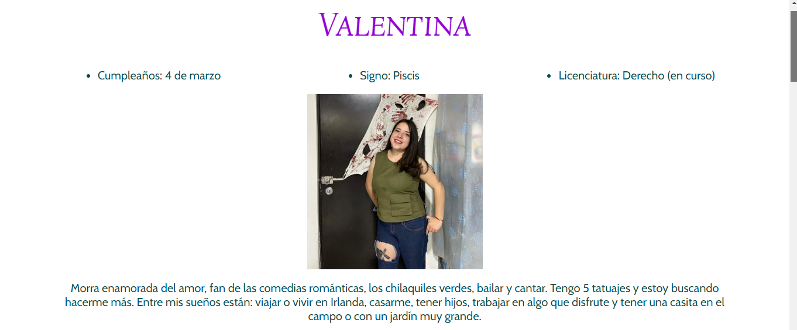
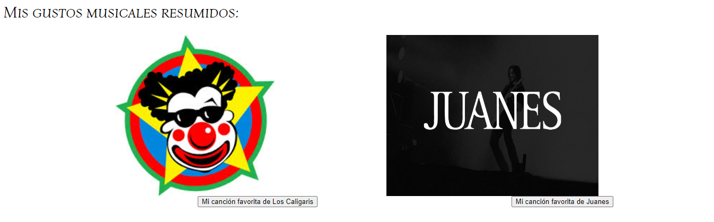
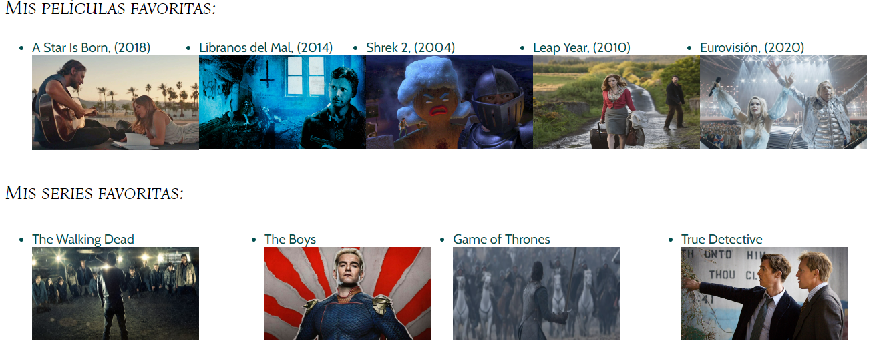
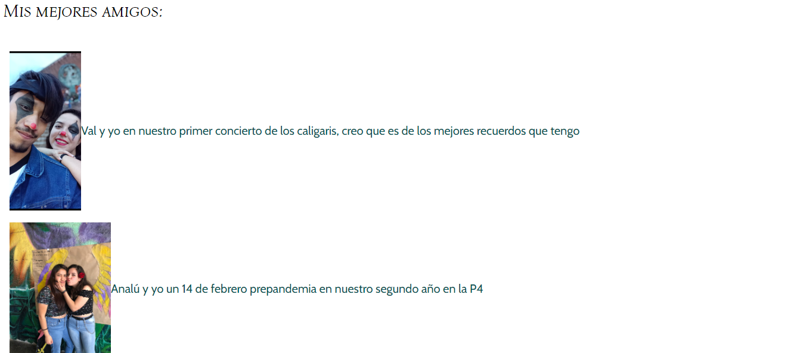

# Página de mis intereses Tecnolochicas Pro
El presente proyecto es una página desarrollada desde cero para poner en práctica las habilidades obtenidas dentro del bootcamp de desarrollo frontend de Technolochicas PRO.

Fue desarrollado exclusivamente con HTML y CSS durante las primeras dos semanas del curso.

Proyecto Desplegado (https://valentina-beta.vercel.app/)

## Secciones de mi sitio

## Tecnologías
* HTML
* CSS

---

Desarrollado con 💗 por Valentina Rosales